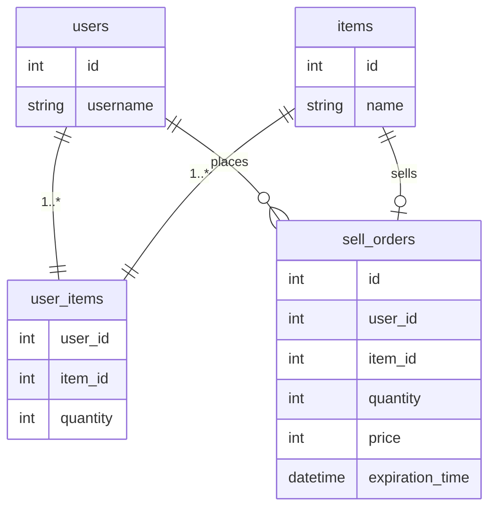

# The Auction House

This is a code test project for [Senior Online Programmer (New Game IP)](https://www.ubisoft.com/en-us/company/careers/search/743999932289413-senior-online-programmer-new-game-ip-) position at Ubisoft Stockholm.

## Build & Run

```sh
mkdir build && cd build
cmake .. && cmake --build . -j 10
./server 3000 db.sqlite
```

## Client

This repo also contains a minimalistic client that sends everything you type in console to the server and prints everything server sends back. The telnet can be used instead.

```sh
./client localhost:3000
```

## Storage

SQLite3 is used to store data in file.



## VS2019 note

This Auction House implementation uses boost.asio (as a standalone library) and corutines, which are [supported by VS2019 from 16.8 version](https://learn.microsoft.com/en-us/cpp/overview/visual-cpp-language-conformance?view=msvc-170). Please ensure that you use the latest available version of the VS2019.
